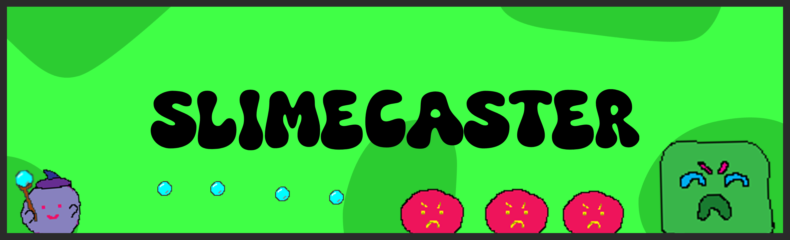
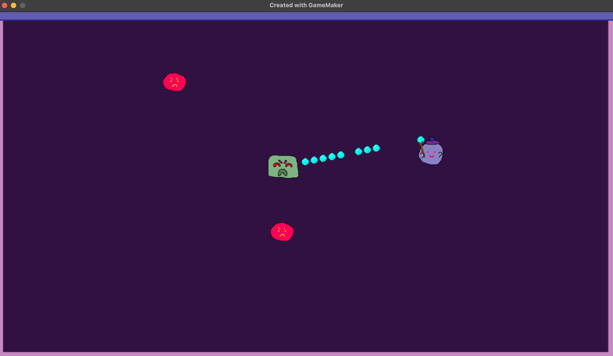
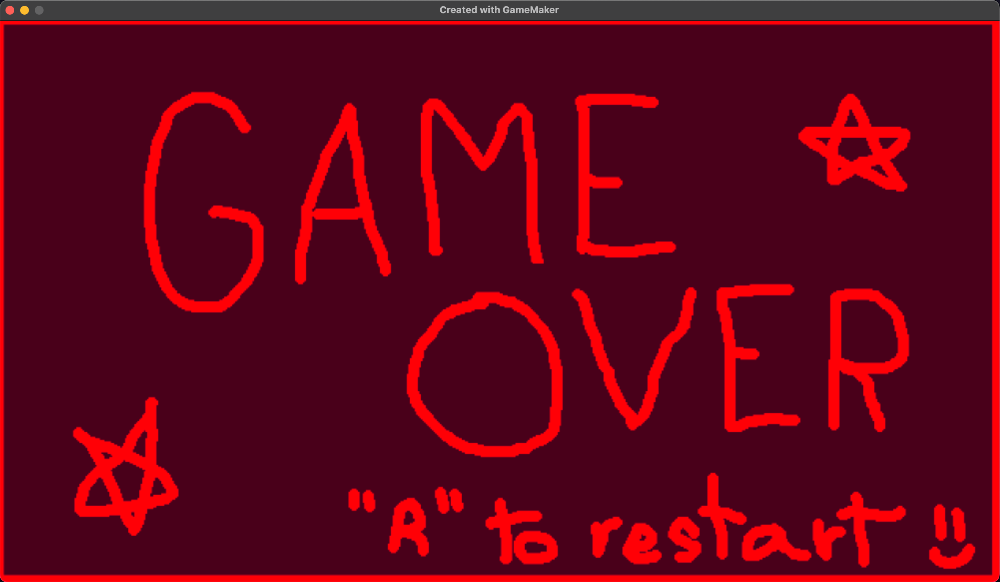
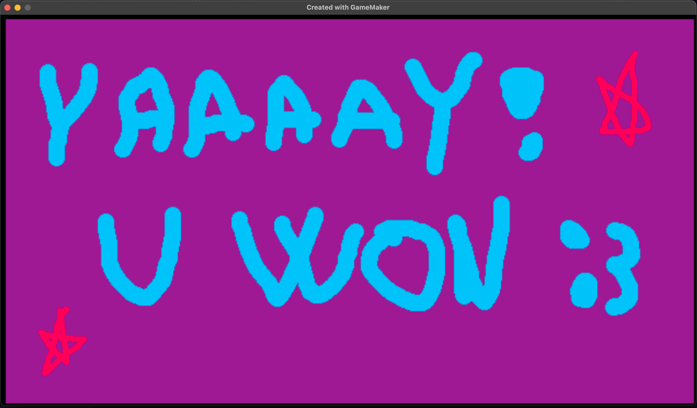

# 💚Slimecaster💚

**Slimecaster** is a fast-paced action game made in **GameMaker Studio 2**, where you play as a powerful slime mage fighting for survival against a rival species of red slimes.

## Project Description

This is a **GameMaker Studio 2** project about a slime mage, battling his rival species — the scarlet slime — to survive. The king of this species, the one and only Gravul, King of the Scarlet Horde. The game is built with fun, fast action and magical abilities to keep players engaged in the fight for survival.

## Game Overview

In **Slimecaster**, you use a variety of magical slime abilities to shoot, reload, and defeat waves of enemy red slimes. The key to survival is mastering your spells and keeping up with the intense pace of the battle! The winning objective is striking down the king of the hoard.

## How to Play

1. Use your mouse to aim at the red slimes.
2. Left-click for single shots and right-click to unleash a powerful ten-shot burst.
3. Use the `X` key to reload the burst cannon.
4. Spin the mouse wheel for quick bursts of fire.

## Controls

- **Left Click**: Single shoot
- **Right Click**: Ten-shot burst
- **X**: Reload
- **Mouse Wheel**: Quick fire

## Installation

Download the latest version of this game <a href="https://github.com/kireiiiiiiii/Slimecaster/releases">here</a>.

## Installation from source code

1. Clone or download the repository.
2. Open the project in **GameMaker Studio 2**.
3. Build and run the game to start battling enemy slimes!

## Screenshots

## Contact information

This is a side project, made mainly for my Video game design class, but feel free to open an issue if you find a bug, or contact me on instagram <a href="https://www.instagram.com/_kireiiiiiiii?utm_source=ig_web_button_share_sheet&igsh=ZDNlZDc0MzIxNw==">@_kireiiiiiiii</a>.

---

Have fun casting your slime spells!
